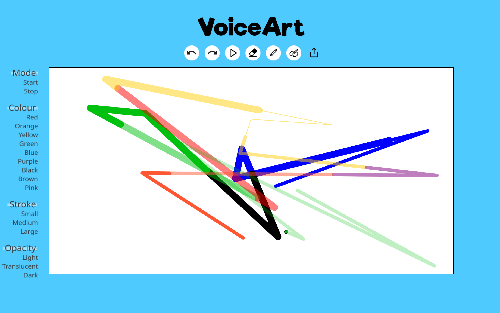

# Hey there, I'm Soohyun Kim (김수현) 👋

  

---

## 👩🏻‍💻 About Me

<table>
  <tr>
    <td></td>
    <td>
      <ul>
        <li>Current <b>Cloud DevOps Engineer</b> @ Sun Life Financial</li>
        <li>Former <b>Data Engineer</b> @ Loblaw Companies Limited</li>
        <li>Former <b>Automation Engineer</b> @ Nissan Motor Corporation</li>
        <li>Alumni of <b>Management Engineering</b> with minor in Computing @ University of Waterloo (graduated in April 2023)</li>
        <li>Software, automation & AI/ML enthusiast</li>
      </ul>
    </td>
  </tr>
</table>

## ⚙️ Tech Stack

  

  

  

  

  

## 💡 Previous Projects

### <a href="https://drive.google.com/file/d/1x0QnM4RGB66VMYbTJnMKlgvgKuj-Lz6p/view?usp=sharing">🚗 SmartManual (Apr 2023)</a>

- **AI-powered** website created for Final Year Design Project that allows non-experts to query their car-related questions using their own non-expert language
- Created with Figma, Python, JavaScript

### <a href="https://devpost.com/software/voiceart">🗣️ VoiceArt (Jan 2021)</a>

- Website that allows users to create abstract art through a **hands-free** experience
- Created with Figma, HTML/CSS, JavaScript, Firebase
  

### <a href="https://spellmanager-s449kim.herokuapp.com">🔮 Spell Manager (Aug 2020)</a>

- Website for **Dungeons & Dragons** players to manage their spells and spellbooks
- Created with HTML/CSS, Ruby on Rails, SQL, Heroku

### <a href="https://rails-wordgame-s449kim.herokuapp.com/">🧩 WordGame (Jul 2020)</a>

- Website that allows users to play a word game just like **Hangman**
- Created with HTML/CSS, Ruby on Rails, SQL, Heroku

### <a href="https://small-potatoes-s449kim.herokuapp.com">⭐ Small Potatoes (Jul 2020)</a>

- Review-aggregation website like **Rotten Tomatoes**
- Created with HTML/CSS, Ruby on Rails, SQL, Heroku
